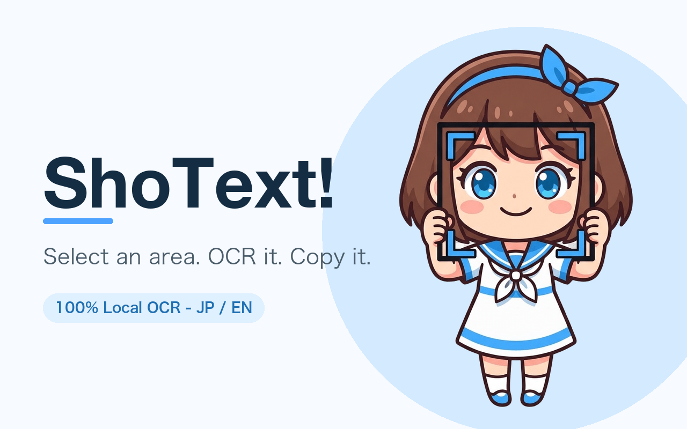

# ShoText！- ショッテキ！

A Chrome extension that lets you drag-select any area of the screen and instantly OCRs the text locally, copying it straight to your clipboard.

## 📥 Install

https://chromewebstore.google.com/detail/%E3%82%B7%E3%83%A7%E3%83%83%E3%83%86%E3%82%AD%EF%BC%81-shotext%EF%BC%81/gpfjbnfccfhfnbafdkadhckfnjdpfcpm

[](./LICENSE)

🇺🇸 [English](#english) | 🇯🇵 [日本語](#日本語)

---

## English



### What is this?

**Shotext！** is a Chrome extension that lets you drag-select any area of a web page and instantly OCRs it, copying the recognized text straight to your clipboard.

- OCR runs entirely on-device using [Tesseract.js](https://github.com/naptha/tesseract.js) — no image or recognized text is ever sent to a server
- Supports Japanese and English

### Usage

1. Press `Alt+Shift+D`
2. Drag to select an area containing text
3. Wait a moment — the recognized text is automatically copied to your clipboard (a toast notification confirms the copy)
4. Paste it wherever you like

### Installation

Open the [Chrome Web Store listing](https://chromewebstore.google.com/detail/%E3%82%B7%E3%83%A7%E3%83%83%E3%83%86%E3%82%AD%EF%BC%81-shotext%EF%BC%81/gpfjbnfccfhfnbafdkadhckfnjdpfcpm) and click "Add to Chrome".

To build from source instead:

```bash
git clone <this repository URL>
cd shotext
pnpm install
pnpm --filter @shotext/local-ocr build
```

1. Open `chrome://extensions` in Chrome
2. Enable "Developer mode" (top right)
3. Click "Load unpacked"
4. Select the `packages/local-ocr/dist` folder

### Architecture

This is a pnpm workspace monorepo.

- `packages/core` — shared logic: the selection overlay UI, image cropping, and the copy toast
- `packages/local-ocr` — the extension itself, using Tesseract.js (WebAssembly) for fully local OCR
- Built with Vite + [@crxjs/vite-plugin](https://crxjs.dev/vite-plugin)

### Why I built this

I got tired of manually retyping code and prompts from programming tutorial videos, so I built this to copy text straight off the screen instead. The full backstory is written up on Zenn / dev.to.

- dev.to (English): [I Built a Chrome Extension to Copy Text from YouTube Videos](https://dev.to/enknot96/i-built-a-chrome-extension-to-copy-text-from-youtube-videos-2cen)

### License

[MIT License](./LICENSE)

---

## 日本語


### これは何？

「ショッテキ！」は、Webページ上の好きな範囲をドラッグで選択するだけで、自動でOCR（文字認識）してテキスト化し、クリップボードにコピーしてくれるChrome拡張機能です。

- OCRは[Tesseract.js](https://github.com/naptha/tesseract.js)を使い、すべて**ローカル（ブラウザ内）で処理**します。画像も認識結果も外部サーバーへ送信されることはありません
- 日本語・英語に対応

### 使い方

1. ショートカット `Alt+Shift+D` を押す
2. 文字を含む範囲をドラッグで選択する
3. 少し待つと、認識されたテキストが自動でクリップボードにコピーされます（コピー完了はトースト通知でお知らせします）
4. あとは好きな場所に貼り付けるだけです

### インストール

[Chrome ウェブストアのページ](https://chromewebstore.google.com/detail/%E3%82%B7%E3%83%A7%E3%83%83%E3%83%86%E3%82%AD%EF%BC%81-shotext%EF%BC%81/gpfjbnfccfhfnbafdkadhckfnjdpfcpm)を開き、「Chromeに追加」をクリックしてください。

ソースからビルドする場合は以下の手順です。

```bash
git clone <このリポジトリのURL>
cd shotext
pnpm install
pnpm --filter @shotext/local-ocr build
```

1. Chromeで `chrome://extensions` を開く
2. 右上の「デベロッパーモード」をONにする
3. 「パッケージ化されていない拡張機能を読み込む」を選択する
4. `packages/local-ocr/dist` フォルダを選択する

### 構成

pnpm workspaceによるmonorepo構成です。

- `packages/core` — 範囲選択UI、画像切り抜き、トースト通知などの共通ロジック
- `packages/local-ocr` — Tesseract.js（WebAssembly）を使ったローカルOCR版の拡張機能本体
- ビルドにはVite + [@crxjs/vite-plugin](https://crxjs.dev/vite-plugin)を使用

### 開発の背景

プログラミング学習の動画から、コードやプロンプトを毎回手打ちで写すのが面倒だったことがきっかけで開発しました。なぜこれを作ったのか、という経緯は、英語ですが、dev.toの記事にまとめています。

- dev.to（English）: [I Built a Chrome Extension to Copy Text from YouTube Videos](https://dev.to/enknot96/i-built-a-chrome-extension-to-copy-text-from-youtube-videos-2cen)

### ライセンス

[MIT License](./LICENSE)
